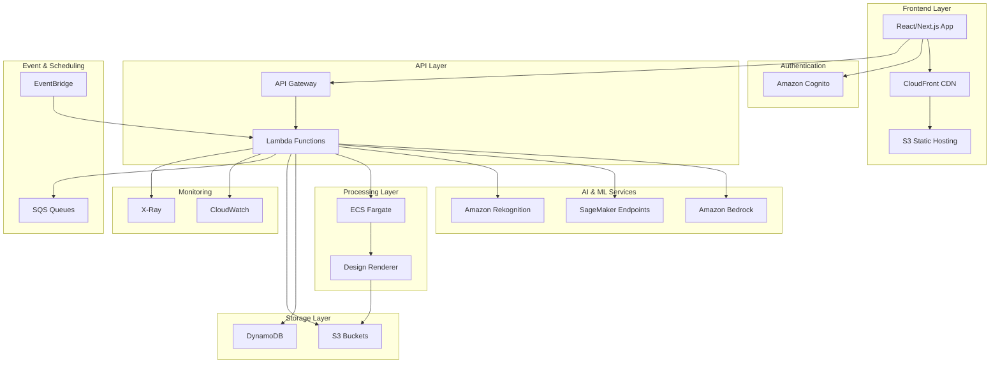

# Design Document: Indian Social Media Platform

## Overview

The Indian Social Media Platform is an AI-powered, brand-aware design system that automatically generates culturally relevant social media creatives for Indian brands. The platform combines advanced AI capabilities with deep understanding of Indian festivals, languages, and cultural nuances to deliver instant, professional-quality social media content.

The system eliminates the traditional design workflow by providing a no-code solution where marketers simply select an occasion and receive ready-to-post creatives that maintain brand consistency while incorporating appropriate cultural elements.

## Architecture

The platform follows a serverless-first, microservices architecture built entirely on AWS services to ensure scalability, cost-effectiveness, and reliability during high-traffic periods like major festivals.



## Components and Interfaces

### Frontend Layer

**CloudFront + S3 Static Hosting**
- Serves React/Next.js application globally with low latency
- Implements caching strategies for static assets and API responses
- Provides HTTPS termination and security headers
- Optimized for Indian geography with edge locations

**React/Next.js Application**
- Server-side rendering for improved SEO and performance
- Progressive Web App (PWA) capabilities for mobile experience
- Responsive design optimized for Indian mobile devices
- Real-time preview of generated creatives

### Authentication & Authorization

**Amazon Cognito**
- User pools for brand team management
- Identity pools for secure AWS resource access
- Multi-factor authentication for brand administrators
- Role-based access control (Admin, Marketing Manager, Content Creator)
- Integration with corporate identity providers (SAML/OIDC)

### API Layer

**Amazon API Gateway**
- RESTful APIs with request/response validation
- Rate limiting and throttling for fair usage
- API key management for third-party integrations
- CORS configuration for web application access
- Request/response transformation and caching

**AWS Lambda Functions**
- Brand onboarding and asset management
- Festival calendar and occasion management
- Creative generation orchestration
- User management and permissions
- Analytics and reporting services
- Webhook handlers for external integrations

### AI & Machine Learning Services

**Amazon Bedrock**
- **Stable Diffusion 3.5 Large**: Primary image generation model for high-quality creatives
- **Amazon Titan Image Generator**: Backup image generation with AWS-native integration
- **Claude 3.5 Sonnet**: Multilingual content generation and cultural context understanding
- **Amazon Nova Canvas**: Advanced image editing and brand asset integration

**Amazon SageMaker**
- **Custom Layout Intelligence Model**: Trained on Indian design preferences and cultural aesthetics
- **Brand Compliance Model**: Ensures generated designs adhere to brand guidelines
- **Color Harmony Model**: Optimizes color combinations while respecting brand colors
- **Template Selection Model**: Chooses appropriate layouts based on content type and occasion
- **Real-time inference endpoints** with auto-scaling capabilities

**Amazon Rekognition**
- Logo detection and placement validation
- Brand asset quality assessment
- Content moderation for generated creatives
- Text detection in multilingual content

### Processing Layer

**Amazon ECS with AWS Fargate**
- Containerized design rendering service for complex image composition
- Auto-scaling based on demand with zero server management
- Supports high-resolution image processing up to 100MB
- Handles batch processing for bulk creative generation
- Integrates multiple brand assets, AI-generated content, and templates

**Design Renderer Service**
- Combines brand assets (logos, fonts, colors) with AI-generated content
- Applies cultural and festival-specific design elements
- Generates platform-specific formats (Instagram, WhatsApp, Facebook, LinkedIn)
- Implements advanced typography for multilingual content
- Ensures accessibility compliance and readability standards

### Storage Layer

**Amazon S3**
- **Brand Assets Bucket**: Secure storage for logos, fonts, and brand guidelines
- **Generated Creatives Bucket**: Versioned storage for all generated content
- **Template Assets Bucket**: Cultural elements, festival graphics, and design components
- **Analytics Data Bucket**: Performance metrics and usage analytics
- Lifecycle policies for cost optimization
- Cross-region replication for disaster recovery

**Amazon DynamoDB**
- **Users Table**: User profiles, permissions, and preferences
- **Brands Table**: Brand information, guidelines, and asset references
- **Festivals Table**: Comprehensive Indian festival calendar with regional variations
- **Creatives Table**: Metadata for generated creatives and performance tracking
- **Templates Table**: Design templates with cultural and occasion mappings
- Global secondary indexes for efficient querying
- Point-in-time recovery and backup automation

### Event & Scheduling

**Amazon EventBridge**
- Festival reminder notifications
- Automated campaign suggestions
- Scheduled creative generation for recurring campaigns
- Integration with external calendar systems
- Custom event patterns for brand-specific triggers

**Amazon SQS**
- Asynchronous processing queues for creative generation
- Dead letter queues for error handling and retry logic
- FIFO queues for ordered processing when required
- Integration with Lambda for event-driven processing

### Monitoring & Analytics

**Amazon CloudWatch**
- Application performance monitoring
- Custom metrics for creative generation success rates
- Log aggregation and analysis
- Automated alerting for system health
- Cost monitoring and optimization insights

**AWS X-Ray**
- Distributed tracing for request flow analysis
- Performance bottleneck identification
- Service dependency mapping
- Error root cause analysis

## Data Models

### Brand Model
```typescript
interface Brand {
  brandId: string;
  name: string;
  industry: string;
  targetRegions: string[];
  assets: {
    logos: LogoAsset[];
    colors: BrandColor[];
    fonts: FontAsset[];
    guidelines: string;
  };
  preferences: {
    designStyle: 'modern' | 'traditional' | 'minimal' | 'vibrant';
    culturalSensitivity: 'high' | 'medium' | 'low';
    languagePreferences: string[];
  };
  createdAt: Date;
  updatedAt: Date;
}

interface LogoAsset {
  assetId: string;
  s3Key: string;
  format: string;
  dimensions: { width: number; height: number };
  usage: 'primary' | 'secondary' | 'monochrome';
}

interface BrandColor {
  name: string;
  hex: string;
  usage: 'primary' | 'secondary' | 'accent' | 'background';
}
```

### Festival Model
```typescript
interface Festival {
  festivalId: string;
  name: string;
  nameTranslations: Record<string, string>;
  type: 'national' | 'regional' | 'religious' | 'cultural';
  regions: string[];
  dates: {
    year: number;
    startDate: Date;
    endDate: Date;
    isLunar: boolean;
  }[];
  culturalElements: {
    colors: string[];
    symbols: string[];
    themes: string[];
    greetings: Record<string, string>;
  };
  marketingRelevance: 'high' | 'medium' | 'low';
}
```

### Creative Model
```typescript
interface Creative {
  creativeId: string;
  brandId: string;
  festivalId?: string;
  occasionType: string;
  platforms: Platform[];
  content: {
    text: Record<string, string>; // language -> text
    images: GeneratedImage[];
    metadata: CreativeMetadata;
  };
  performance: {
    views: number;
    downloads: number;
    shares: number;
    engagement: number;
  };
  generatedAt: Date;
  status: 'draft' | 'approved' | 'published';
}

interface GeneratedImage {
  platform: Platform;
  dimensions: { width: number; height: number };
  s3Key: string;
  format: string;
  fileSize: number;
}

type Platform = 'instagram-post' | 'instagram-story' | 'facebook-post' | 
                'linkedin-post' | 'whatsapp-business' | 'twitter-post';
```

### User Model
```typescript
interface User {
  userId: string;
  email: string;
  name: string;
  role: 'brand-admin' | 'marketing-manager' | 'content-creator';
  brandId: string;
  permissions: Permission[];
  preferences: {
    language: string;
    timezone: string;
    notifications: NotificationSettings;
  };
  lastLoginAt: Date;
  createdAt: Date;
}

interface Permission {
  resource: string;
  actions: ('read' | 'write' | 'delete' | 'approve')[];
}
```

## Correctness Properties

*A property is a characteristic or behavior that should hold true across all valid executions of a system—essentially, a formal statement about what the system should do. Properties serve as the bridge between human-readable specifications and machine-verifiable correctness guarantees.*

Based on the prework analysis, I'll now convert the testable acceptance criteria into correctness properties:

### Property Reflection

After reviewing all properties identified in the prework, I've identified several areas where properties can be consolidated:

- Properties 1.2, 4.2, and 7.4 all relate to brand compliance and can be combined into a comprehensive brand adherence property
- Properties 5.1, 5.2, and 5.3 all relate to platform-specific formatting and can be consolidated
- Properties 8.1, 8.2, 8.3, 8.4, and 8.5 all relate to analytics and can be streamlined
- Properties 6.1, 6.2, 6.3, 6.4, and 6.5 all relate to security and access control

### Correctness Properties

**Property 1: Brand Asset Validation and Storage**
*For any* uploaded brand asset file, the platform should store valid formats securely while rejecting invalid formats with appropriate error messages
**Validates: Requirements 1.1**

**Property 2: Brand Compliance Enforcement**
*For any* generated creative, all visual elements (colors, fonts, logos) should only use assets from the brand's approved collection and adhere to brand guidelines
**Validates: Requirements 1.2, 1.3, 4.2, 7.4**

**Property 3: Asset Version Management**
*For any* brand asset modification, the platform should maintain complete version history and allow rollback to any previous version
**Validates: Requirements 1.5**

**Property 4: Festival Intelligence and Suggestions**
*For any* date within 30 days of a festival, the platform should automatically suggest culturally appropriate themes and templates for that festival
**Validates: Requirements 2.1, 2.2**

**Property 5: Festival Calendar Accuracy**
*For any* year and festival, the platform should provide accurate dates that account for lunar calendar variations and regional differences
**Validates: Requirements 2.4**

**Property 6: Multilingual Content Generation**
*For any* supported language selection, the platform should generate text content in the correct language with appropriate typography and script rendering
**Validates: Requirements 3.1, 3.3, 3.5**

**Property 7: Creative Generation Performance**
*For any* creative generation request with valid inputs, the platform should return multiple creative options within 30 seconds
**Validates: Requirements 4.1**

**Property 8: Platform Format Compliance**
*For any* platform-specific creative request, the generated output should match exact dimension requirements and file format specifications for that platform
**Validates: Requirements 4.3, 5.1, 5.2, 5.3**

**Property 9: Cultural Element Integration**
*For any* festival-based creative generation, the output should incorporate culturally relevant visual elements appropriate to the selected festival
**Validates: Requirements 4.4**

**Property 10: Export Format Availability**
*For any* generated creative, the platform should provide download options in all specified file formats (PNG, JPG, MP4) with correct file integrity
**Validates: Requirements 5.5**

**Property 11: Authentication and Authorization**
*For any* user registration and login attempt, the platform should enforce secure authentication protocols and role-based access permissions
**Validates: Requirements 6.1, 6.2, 6.3**

**Property 12: Audit Trail Completeness**
*For any* brand asset modification or creative generation action, the platform should create complete audit log entries with user, timestamp, and action details
**Validates: Requirements 6.4**

**Property 13: Session Security Management**
*For any* user session, the platform should enforce secure session management with automatic timeout and proper session invalidation
**Validates: Requirements 6.5**

**Property 14: Layout Selection Intelligence**
*For any* creative generation request, the platform should select layouts that are appropriate for the content type and comply with brand guidelines
**Validates: Requirements 7.1**

**Property 15: Logo Placement Consistency**
*For any* generated creative, brand logos should be properly placed with adequate visibility and consistent positioning across all outputs
**Validates: Requirements 7.2**

**Property 16: Analytics Data Collection**
*For any* creative generation or user interaction, the platform should accurately track and store relevant usage patterns and performance metrics
**Validates: Requirements 8.1, 8.2, 8.3, 8.4, 8.5**

**Property 17: Infrastructure Auto-scaling**
*For any* load variation, the platform should automatically scale computing resources to maintain performance while optimizing costs
**Validates: Requirements 9.1, 9.2**

**Property 18: Service Availability**
*For any* 24-hour period, the platform should maintain 99.9% uptime for critical creative generation services
**Validates: Requirements 9.3**

**Property 19: Storage Reliability**
*For any* stored brand asset, the platform should maintain secure, redundant storage with verifiable backup and recovery capabilities
**Validates: Requirements 9.4**

**Property 20: API Integration Functionality**
*For any* API call to integration endpoints, the platform should provide correct responses that enable seamless integration with external tools
**Validates: Requirements 10.1, 10.3**

**Property 21: Automated Campaign Management**
*For any* scheduled campaign, the platform should automatically generate creatives at specified times and send appropriate notifications
**Validates: Requirements 10.2, 10.4**

**Property 22: Bulk Processing Efficiency**
*For any* bulk creative generation request, the platform should process multiple creatives efficiently while maintaining individual quality standards
**Validates: Requirements 10.5**

## Error Handling

The platform implements comprehensive error handling across all layers:

### Input Validation Errors
- **Brand Asset Upload**: Validate file formats, sizes, and content before processing
- **User Input**: Sanitize and validate all user inputs to prevent injection attacks
- **API Requests**: Validate request structure, authentication, and rate limits

### AI Service Errors
- **Bedrock API Failures**: Implement retry logic with exponential backoff
- **SageMaker Endpoint Errors**: Fallback to alternative models or cached responses
- **Content Generation Failures**: Provide meaningful error messages and alternative suggestions

### Infrastructure Errors
- **Lambda Timeouts**: Implement circuit breakers and graceful degradation
- **DynamoDB Throttling**: Use exponential backoff and request batching
- **S3 Access Errors**: Implement retry mechanisms and alternative storage paths

### Business Logic Errors
- **Brand Compliance Violations**: Reject creatives that don't meet brand standards
- **Cultural Sensitivity Issues**: Flag potentially inappropriate content for review
- **Festival Date Conflicts**: Handle overlapping festivals and regional variations

### Error Response Format
```typescript
interface ErrorResponse {
  error: {
    code: string;
    message: string;
    details?: Record<string, any>;
    timestamp: string;
    requestId: string;
  };
}
```

## Testing Strategy

The platform employs a comprehensive dual testing approach combining unit tests for specific scenarios and property-based tests for universal correctness validation.

### Property-Based Testing

**Framework**: We will use **fast-check** for TypeScript/JavaScript property-based testing, configured to run a minimum of 100 iterations per property test to ensure comprehensive input coverage.

**Property Test Implementation**:
- Each correctness property will be implemented as a separate property-based test
- Tests will be tagged with: **Feature: indian-social-media-platform, Property {number}: {property_text}**
- Property tests will generate random inputs within valid domains to verify universal behaviors
- Tests will focus on core business logic and data integrity requirements

**Key Property Test Areas**:
- Brand asset validation with random file types and sizes
- Creative generation with random brand configurations and festival selections
- Multilingual content generation across all supported languages
- Platform format compliance with various content types
- Authentication and authorization with different user roles and permissions

### Unit Testing

**Framework**: Jest with React Testing Library for frontend components and AWS SDK mocking for backend services.

**Unit Test Focus Areas**:
- **Component Testing**: React components with various props and states
- **API Integration**: Lambda function handlers with mocked AWS services
- **Edge Cases**: Empty inputs, boundary values, and error conditions
- **Cultural Content**: Specific festival templates and regional variations
- **Performance**: Response time validation and resource usage

**Test Organization**:
- Co-locate tests with source files using `.test.ts` suffix
- Separate integration tests for cross-service functionality
- Mock external dependencies (AWS services, third-party APIs)
- Use test data factories for consistent test scenarios

### Integration Testing

**End-to-End Workflows**:
- Complete creative generation flow from brand setup to final output
- Multi-platform creative generation and export
- User authentication and role-based access scenarios
- Festival calendar updates and automated suggestions

**Performance Testing**:
- Load testing for festival traffic spikes
- Creative generation performance under various conditions
- Database query performance with large datasets
- CDN and caching effectiveness

### Testing Configuration

**Property-Based Test Settings**:
```typescript
// Example property test configuration
fc.configureGlobal({
  numRuns: 100, // Minimum iterations per property
  timeout: 30000, // 30 second timeout for complex properties
  seed: Date.now(), // Reproducible test runs
});
```

**Test Environment**:
- Separate AWS accounts for testing and production
- Automated test data cleanup and environment reset
- Continuous integration with GitHub Actions
- Automated deployment to staging environment for integration tests

The testing strategy ensures that both specific use cases and universal properties are thoroughly validated, providing confidence in the platform's correctness and reliability across all supported scenarios and cultural contexts.